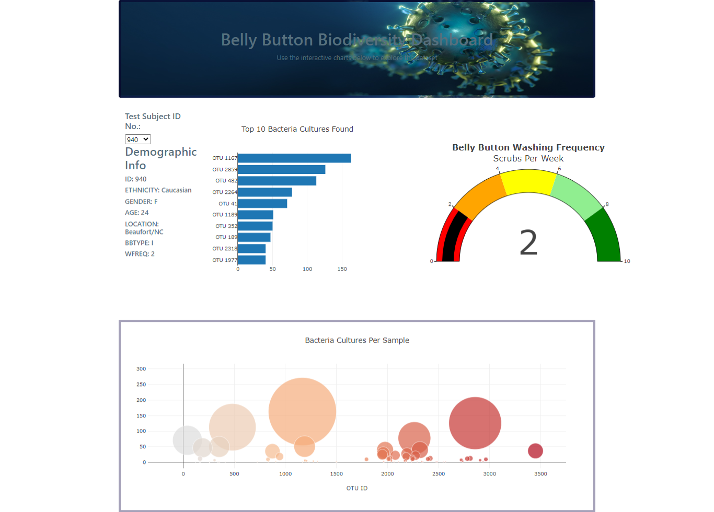

# Belly Button Biodiversity Dashboard

CU-VIRT-DATA-PT-02-2021-U-B-TTH - Belly Button Biodiversity Dashboard - 12

Paul Do 2021/05/09

## Overview of Javascript for implementing Plotly charts

The purpose of this project is to develop webpages using json files and Plotly charts

## Resource

Data Source:  [samples.json](static/data/samples.json) 

Code files:  [charts.js](static/js/charts.js)  [style.css](static/css/style.css) 

Software: Google Chrome 90.0.4430.93 

## Results

Using 3 Bootstrap,  background-image: url("../images/home-banner.jpg");, color: #57707d;, and border: solid 5px rgba(10, 0, 66, 0.37); on css

## Summary

